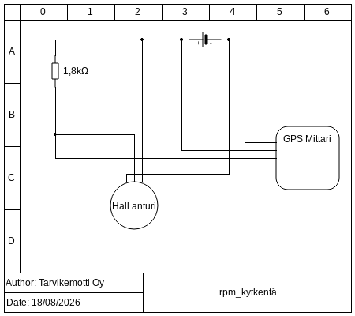

# gps-mittarin-kierroslukumittarin-kalibrointi
Ohje GPS-mittarin kierroslukumittarin kalibrointiin.

# Ohje

## Ohje video

## Alustus

Kytkemittari mukana tulleen ohjeen mukaisesti. Kytkentää varten tulee kytkeä ainakin maa, virta ja rpm signaali. Mallista riippuen mittari vaatii mahdollisesti GPS signaalin asetustilaan pääsemistä varten. Tällöin GPS antenni pitää olla myös liitetty ja joudutaan odottamaan kunnes mittari löytää GPS signaalin ennen kuin asetuksia voidaan muuttaa.

### RPM signaali

RPM signaalin voi ottaa mm. W-navasta, moottorin ohjaimelta tai muulta kierroslukumittarin anturilta. Malli videolla käytettiin HALL-anturia. Tällöin tarvitaan erikseen pullup vastus, jotta signaalissa on selvä luettava muutos mittarille.

## Kalibrointi

Normi tilassa laitteen näytössä näkyy matkamittarin lukuja. Mittarin takaosassa on nappi, jonka avulla mittarin asetuksia voidaan muuttaa. Lyhyellä painalluksella voidaan liikkua asetusvalikossa seuraavaan kohtaa. Valintoina on rpm mittarin kalibrointi eli "Set pulse rate" ja nopeusvaroittimen säätö. Muutettava asetus valitaan pitämällä nappia pitkään pohjassa kunnes näyttöön ilmestyy "---.-" merkintä toiselle riville. Irti päästettäessä näytössä näkyy nykyinen asetus. Asetusta voi muuttaa pitämällä nappia pohjassa. Luku lähtee ylös- ja alaspäin vuorotellen, kun nappia painetaan uudestaan pohjaan. Kokeile arvoja 1-360 välillä kunnes löydät asetuksen, jolla mittari näyttää oikeaa. Diesel moottoreiden kanssa kaveriksi tarvitaan yleensä erillinen takometri oikean arvon löytämiseksi. 

Malli videolla on käytössä vain yksi tappi suoraan kuvitteellisessa kampiakselissa, joten siinä oikea asetus on 1.0. Muissa tilanteissa signaalin tuottamien harjojen ja moottorin pyörimisnopeuden suhde on mahdollisesti jotain muuta riippuen, mistä rpm-signaali otetaan.
